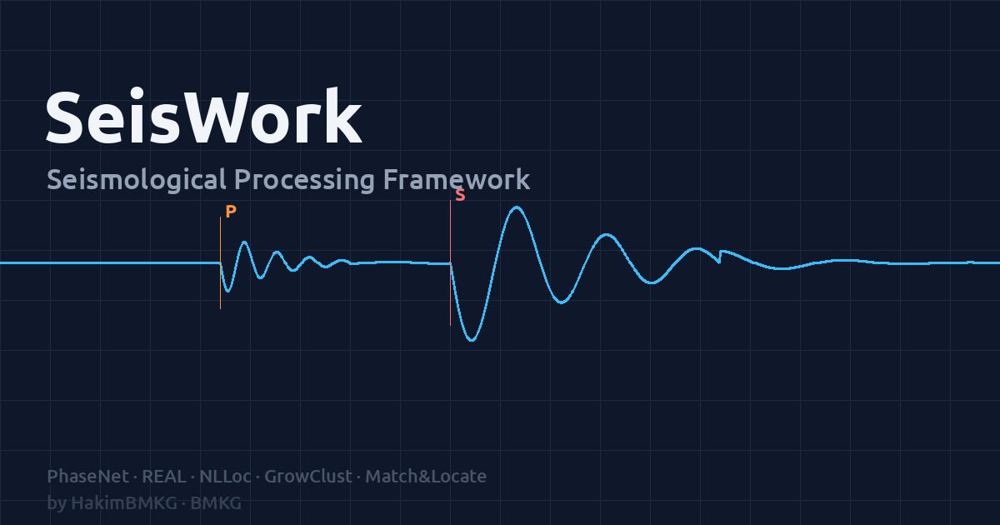

# SeisWork



**SeisWork** is a Python framework for Simple Seismological Data Processing Framework.

---

## Pipeline

```
Waveform (SDS)
    └── Picker (PhaseNet / EQTransformer)
            ├── GaMMA  associate   → catalog_gamma.csv  → Gamma_Phase.txt
            ├── REAL   associate   → catalog_real.csv   → REAL_Phase.txt
            ├── PyOcto associate   → catalog_pyocto.csv (4D octree + EDT)
            ├── glass3 associate   → catalog_glass3.csv (USGS NEIC grid/Bayesian stacking)
            ├── associated catalog → NLLoc   → catalog_nlloc.csv  → NLL_Phase.txt
            ├── associated catalog → LocSAT  → catalog_locsat.csv → LOCSAT_Phase.txt
            ├── ML → magnitude (Hutton & Boore 1987; network magnitude via scmag-style trimmed mean)
            └── Focal mechanism (SKHASH/HASH + FocoNet) → OUT/out.csv, foconetout/foconet_out.csv + beachball.png
```

Any of the four associators (GaMMA/REAL/PyOcto/glass3) can feed the same
downstream location/magnitude/mechanism steps — pick one per run (batch
pipeline) or per session (realtime online-monitor).

---

## Install

Smart cross-platform installer — **Linux • macOS • WSL**. Detects OS,
architecture, and package manager (apt/dnf/yum/zypper/pacman or Homebrew),
then installs whatever is missing: compilers (gcc/gfortran/cmake), Python,
or conda (bootstraps **Miniforge** with no root needed).

```bash
git clone https://github.com/hakimbmkg/seiswork.git
cd seiswork
bash install.sh          # OS deps + env (conda/venv) + compile + Python, all automatic
conda activate seiswork  # (venv mode: bash ~/start_seiswork.sh)
```

A full `bash install.sh` runs steps 1–8 **plus** step 10, which installs a
desktop launcher automatically:

- **macOS** → a real `~/Applications/SeisWork.app` (Dock icon + name "SeisWork").
- **Linux** → a `~/.local/share/applications/seiswork.desktop` entry (shows up
  in the application menu under Science/Education).

Double-clicking it opens the GUI in a native desktop window.

Options:

```bash
bash install.sh --venv     # use a Python venv instead of conda
bash install.sh --no-auto  # only report missing dependencies, don't install them
bash install.sh --check    # installation status summary
bash install.sh --step 3   # rerun a specific step (3 = compile binaries)
bash install.sh --service  # install/update the auto-start service only (step 8)
bash install.sh --desktop  # create the desktop app only (step 10)
```

---

## Running the GUI

After install, launch the web GUI in any of these ways:

```bash
# 1. Desktop app (recommended) — created by the installer
#    macOS: open ~/Applications/SeisWork.app   (or search "SeisWork" in Spotlight)
#    Linux: pick "SeisWork" from the application menu

# 2. From the terminal (conda mode)
conda activate seiswork
seiswork gui                 # open in your default browser
seiswork gui --native        # open in a lightweight native desktop window (pywebview)
seiswork gui --port 8080     # choose a different port
seiswork gui --force         # stop any already-running SeisWork server first, then start
```

Then browse to **http://localhost:5000** (or the port shown in the terminal).
On macOS, ports 5000/7000 are held by the AirPlay Receiver — SeisWork
auto-falls-forward to a free port (e.g. 5001) and prints the URL.

### Run on Linux (venv / no conda)

When conda is **not** installed, `install.sh` (or `install.sh --venv`) puts
SeisWork in a Python **venv** at **`~/.venv/seiswork`** — there is no conda env.
Run it one of these ways:

```bash
# a) Launcher script (simplest — activates the venv for you)
bash ~/start_seiswork.sh

# b) Activate the venv manually, then use the `seiswork` command
source ~/.venv/seiswork/bin/activate
seiswork gui                                   # browser
seiswork gui --native                          # native window (needs WebKitGTK; else browser)

# c) Headless server (VM / no desktop) — bind all interfaces, no browser
seiswork gui --host 0.0.0.0 --port 5000 --no-browser
#    then open http://<vm-ip>:5000  from another machine
```

**Not sure which env / how it's installed?** Just run:

```bash
seiswork info      # shows: mode (conda|venv|system), interpreter, service status,
                   #        and the exact command to launch the GUI on THIS machine
```

**Auto-start on boot (systemd user service):**

```bash
seiswork service install                       # create + enable the user service
systemctl --user status  seiswork
systemctl --user restart seiswork
```

### Stop / restart everything

Both are **service-aware** — they stop the systemd (Linux) / launchd (macOS)
service first so it can't respawn, then kill the GUI, web mirror, agent, and
pipeline runners, and free the ports:

```bash
seiswork restart             # stop ALL components + relaunch fresh (native window)
seiswork restart --foreground  # relaunch in the foreground instead of via the service
seiswork stop                # stop ALL components (GUI, mirror, agent, pipelines) — no relaunch
```

> A second `seiswork gui` on a port already in use is refused (a stale duplicate
> would serve old code) with a native popup. Use `--force` to take over, or
> `seiswork restart` to start clean.

---

## Update

One command, run from a `git clone` checkout (not a ZIP download):

```bash
cd seiswork
bash update.sh
```

`update.sh` pulls the latest code, checks binaries/config/Python deps and
repairs anything missing, then restarts the server and verifies it's healthy.
Each sector is checked and auto-repaired independently — `BINARY` (compiled
engines incl. `glass-app`), `GRID/CFG`, `PYTHON` (core imports), `REALTIME`
(picker/associator/locator modules), `ASSOC` (optional associators — PyOcto),
`MECHANISM` (optional focal mechanism — FocoNet source + pyrocko), and
`PROXY` (reverse-proxy upload limits). A summary line at the end reports the
status of every sector.

```bash
bash update.sh --quick     # lighter update: only what the pulled diff touched
bash update.sh --check     # show what's available, don't apply it
bash update.sh --version   # print the current version
```

> `config/config.yaml` and `config/inventory.xml` are meant to be edited
> directly — `seiswork setup` points you at `config/config.yaml` for that.
> Both files are tracked in git, so `update.sh` automatically stashes your
> local edits before `git pull` and restores them right after; it only asks
> you to resolve things by hand if upstream changed the exact same lines.

---

## Uninstall

```bash
bash uninstall.sh              # interactive, safe defaults
bash uninstall.sh --dry-run    # show what would be removed, do nothing
bash uninstall.sh -y           # skip confirmations
```

Removes the systemd service, launcher scripts, `~/bin` symlinks, and the
conda env/venv. The repo checkout and shared installs (Miniforge, Docker
engine) are left alone unless you opt in:

```bash
bash uninstall.sh --docker --purge-build   # also remove Docker images + compiled core/bin
bash uninstall.sh --purge-repo             # delete the whole repo checkout (asks for confirmation)
```

---

## Restart / stop SeisWork

`seiswork restart` and `seiswork stop` are **service-aware**: they stop the
systemd (Linux) / launchd (macOS) service first so it can't auto-respawn, then
kill the GUI, web mirror, agent, and pipeline runners and free the ports.

```bash
seiswork stop                # stop EVERYTHING (no relaunch)
seiswork restart             # stop everything + relaunch fresh
seiswork restart --foreground  # relaunch in the foreground instead of via the service

# Or drive the service directly:
seiswork service restart     # (systemd user unit / launchd agent)
seiswork service status
```

Start it again manually (see **Run on Linux** above for venv details):

```bash
bash ~/start_seiswork.sh                       # venv mode
conda activate seiswork && seiswork gui        # conda mode
seiswork info                                  # not sure? this prints the exact command
```

---

## Error logs (CLI)

```bash
seiswork service log                 # last 50 lines
seiswork service log --lines 200     # more lines

# equivalent, direct systemd query:
journalctl --user -u seiswork -n 100 --no-pager
```

When running a script manually in the background (see [Usage](#usage)),
logs go to wherever you redirected stdout/stderr, e.g. `logs/skenario1.log`.

---

## Usage

Edit the parameters at the top of the script (time range, SDS path,
thresholds), then run:

```bash
cd seiswork

# Scenario 1 — picking with PhaseNet
conda run -n seiswork python examples/run_skenario1_phasenet.py

# Scenario 2 — picking with EQTransformer
conda run -n seiswork python examples/run_skenario2_eqt.py

# Background (for large datasets):
conda run -n seiswork python examples/run_skenario1_phasenet.py \
    > logs/skenario1.log 2>&1 &
```

Every heavy stage (picking, association, location, ML) is **skipped
automatically** when its output file already exists — safe to resume after
an interruption.

---

## Main Parameters

| Parameter | Default | Description |
|---|---|---|
| `T_START / T_END` | — | Analysis time range |
| `SDS_PATH` | `~/seiscomp/var/lib/archive` | SDS waveform archive |
| `NETWORK` | `*` | Network code |
| `P_THRESHOLD` | 0.15 (PhaseNet) / 0.10 (EQT) | P-pick threshold |
| `S_THRESHOLD` | 0.15 (PhaseNet) / 0.10 (EQT) | S-pick threshold |
| `NLLOC_GRID_DIR` | `~/apps/NLLoc/grids/time` | NLLoc travel-time grid |

---

## Module Structure

```
seiswork/
├── modules/
│   ├── picker/       phasenet.py          (PhaseNet & EQTransformer via seisbench)
│   ├── associator/   gamma.py, real.py, pyocto.py, glass3.py
│   ├── locator/      nlloc.py, locsat.py
│   ├── magnitude/    ml.py                (Hutton & Boore 1987)
│   └── mechanism/    polarity.py, skhash_runner.py  (SKHASH/HASH)
│                     foconet_runner.py              (FocoNet, transformer DL)
├── utils/
│   └── converter.py                       (catalog → phaseSA format)
└── parallel.py                            (multiprocessing helper)
```

---

## Main Dependencies

- Python ≥ 3.10, ObsPy ≥ 1.4, PyTorch, seisbench
- GaMMA (phase association)
- NLLoc (probabilistic location)
- REAL (phase association)
- PyOcto (optional, phase association — pip package, https://github.com/yetinam/pyocto)
- glass3 (optional, phase association — compiled from https://github.com/usgs/neic-glass3, no Kafka/broker needed)
- SeisComP (optional, for LocSAT and live SeedLink ingestion)
- SKHASH (optional, focal mechanism — pure Python, https://code.usgs.gov/esc/SKHASH)
- FocoNet (optional, focal mechanism via transformer DL — PyTorch + pyrocko, shares polarity data with SKHASH;
  source+weights from https://github.com/xhsongstanford/FocoNet)

See `environment.yml` and `install.sh` for the full install.

---

## References

Method/algorithm used at each pipeline stage, from phase picking through tomographic imaging and focal mechanisms. Every DOI below was verified against Crossref/the publisher.

| Stage | Method | Reference |
|---|---|---|
| **Waveform I/O** | ObsPy | Beyreuther, M., Barsch, R., Krischer, L., Megies, T., Behr, Y., & Wassermann, J. (2010). ObsPy: a Python toolbox for seismology. *Seismological Research Letters*, 81(3), 530–533. https://doi.org/10.1785/gssrl.81.3.530; Krischer, L., Megies, T., Barsch, R., Beyreuther, M., Lecocq, T., Caudron, C., & Wassermann, J. (2015). ObsPy: a bridge for seismology into the scientific Python ecosystem. *Computational Science & Discovery*, 8(1), 014003. https://doi.org/10.1088/1749-4699/8/1/014003 |
| **Real-time acquisition** | SeisComP | Helmholtz Centre Potsdam — GFZ German Research Centre for Geosciences, & gempa GmbH (2008). The SeisComP seismological software package. *GFZ Data Services*. https://doi.org/10.5880/GFZ.2.4.2020.003 |
| **Workflow architecture (inspiration)** | QuakeFlow | Zhu, W., Hou, A. B., Yang, R., Datta, A., Mousavi, S. M., Ellsworth, W. L., & Beroza, G. C. (2023). QuakeFlow: a scalable machine-learning-based earthquake monitoring workflow with cloud computing. *Geophysical Journal International*, 232(1), 684–693. https://doi.org/10.1093/gji/ggac355 |
| **Picking** | PhaseNet | Zhu, W., & Beroza, G. C. (2019). PhaseNet: a deep-neural-network-based seismic arrival-time picking method. *Geophysical Journal International*, 216(1), 261–273. https://doi.org/10.1093/gji/ggy423 |
| **Picking** | EQTransformer | Mousavi, S. M., Ellsworth, W. L., Zhu, W., Chuang, L. Y., & Beroza, G. C. (2020). Earthquake transformer—an attentive deep-learning model for simultaneous earthquake detection and phase picking. *Nature Communications*, 11, 3952. https://doi.org/10.1038/s41467-020-17591-w |
| **Associate** | GaMMA | Zhu, W., McBrearty, I. W., Mousavi, S. M., Ellsworth, W. L., & Beroza, G. C. (2022). Earthquake phase association using a Bayesian Gaussian mixture model. *Journal of Geophysical Research: Solid Earth*, 127(5). https://doi.org/10.1029/2021JB023249 |
| **Associate** | REAL | Zhang, M., Ellsworth, W. L., & Beroza, G. C. (2019). Rapid earthquake association and location. *Seismological Research Letters*, 90(6), 2276–2284. https://doi.org/10.1785/0220190052 |
| **Associate** | PyOcto | Münchmeyer, J. (2024). PyOcto: A high-throughput seismic phase associator. *Seismica*, 3(1). https://doi.org/10.26443/seismica.v3i1.1130 |
| **Associate** | glass3 (USGS NEIC) | USGS National Earthquake Information Center. glass3 — grid-based/Bayesian-stacking phase associator. Software: https://github.com/usgs/neic-glass3 |
| **Velocity (1D)** | VELEST | Kissling, E., Ellsworth, W. L., Eberhart-Phillips, D., & Kradolfer, U. (1994). Initial reference models in local earthquake tomography. *Journal of Geophysical Research*, 99(B10), 19635–19646. https://doi.org/10.1029/93JB03138 |
| **Locate** | NLLoc (NonLinLoc) | Lomax, A., Virieux, J., Volant, P., & Berge-Thierry, C. (2000). Probabilistic earthquake location in 3D and layered models. In *Advances in Seismic Event Location* (pp. 101–134). Springer. https://doi.org/10.1007/978-94-015-9536-0_5 |
| **Locate** | LocSAT | Bratt, S. R., & Bache, T. C. (1988). Locating events with a sparse network of regional arrays. *Bulletin of the Seismological Society of America*, 78(2), 780–798. https://doi.org/10.1785/BSSA0780020780 |
| **Locate** | Hypoinverse | Klein, F. W. (2002). User's guide to HYPOINVERSE-2000. *USGS Open-File Report* 02-171. https://doi.org/10.3133/ofr02171 |
| **Magnitude** | ML (Wood-Anderson + distance correction) | Hutton, L. K., & Boore, D. M. (1987). The ML scale in southern California. *Bulletin of the Seismological Society of America*, 77(6), 2074–2094. https://doi.org/10.1785/BSSA0770062074 |
| **Relocation (DD)** | HypoDD | Waldhauser, F., & Ellsworth, W. L. (2000). A double-difference earthquake location algorithm: method and application to the northern Hayward fault. *Bulletin of the Seismological Society of America*, 90(6), 1353–1368. https://doi.org/10.1785/0120000006; Waldhauser, F. (2001). hypoDD — a program to compute double-difference hypocenter locations. *USGS Open-File Report* 01-113. https://doi.org/10.3133/ofr01113 |
| **Relocation (DD)** | GrowClust | Trugman, D. T., & Shearer, P. M. (2017). GrowClust: a hierarchical clustering algorithm for relative earthquake relocation, with application to the Spanish Springs and Sheldon, Nevada, earthquake sequences. *Seismological Research Letters*, 88(2A), 379–391. https://doi.org/10.1785/0220160188 |
| **Relocation (DD)** | FDTCC (waveform cross-correlation dt.cc) | Liu, M., Li, H., Li, L., Zhang, M., & Wang, W. (2022). Multistage nucleation of the 2021 Yangbi MS6.4 earthquake, Yunnan, China, and its foreshocks. *Journal of Geophysical Research: Solid Earth*, 127(5). https://doi.org/10.1029/2022JB024091 |
| **Relocation / detection workflow** | LOC-FLOW | Zhang, M., Liu, M., Feng, T., Wang, R., & Zhu, W. (2022). LOC-FLOW: an end-to-end machine learning-based high-precision earthquake location workflow. *Seismological Research Letters*, 93(5), 2426–2438. https://doi.org/10.1785/0220220019 |
| **Detection** | Match & Locate | Zhang, M., & Wen, L. (2015). An effective method for small event detection: match and locate (M&L). *Geophysical Journal International*, 200(3), 1523–1537. https://doi.org/10.1093/gji/ggu466 |
| **Imaging (tomography)** | SIMUL2000 (local earthquake tomography) | Thurber, C., & Eberhart-Phillips, D. (1999). Local earthquake tomography with flexible gridding. *Computers & Geosciences*, 25(7), 809–818. https://doi.org/10.1016/S0098-3004(99)00007-2 |
| **Mechanism (focal mechanism)** | HASH (first-motion polarity) | Hardebeck, J. L., & Shearer, P. M. (2002). A new method for determining first-motion focal mechanisms. *Bulletin of the Seismological Society of America*, 92(6), 2264–2276. https://doi.org/10.1785/0120010200 |
| **Mechanism (focal mechanism)** | HASH (S/P amplitude ratio) | Hardebeck, J. L., & Shearer, P. M. (2003). Using S/P amplitude ratios to constrain the focal mechanisms of small earthquakes. *Bulletin of the Seismological Society of America*, 93(6), 2434–2444. https://doi.org/10.1785/0120020236 |
| **Mechanism (focal mechanism)** | SKHASH (Python implementation) | Skoumal, R. J., Hardebeck, J. L., & Shearer, P. M. (2024). SKHASH: a Python package for computing earthquake focal mechanisms. *Seismological Research Letters*, 95(4), 2519–2526. https://doi.org/10.1785/0220230329 |
| **Mechanism (focal mechanism)** | FocoNet (transformer deep learning) | Song, X., Meier, M.-A., Ellsworth, W. L., & Beroza, G. C. (2026). FocoNet: transformer-based focal-mechanism determination. *Journal of Geophysical Research: Machine Learning and Computation*, 3(2). https://doi.org/10.1029/2025JH000879 |
